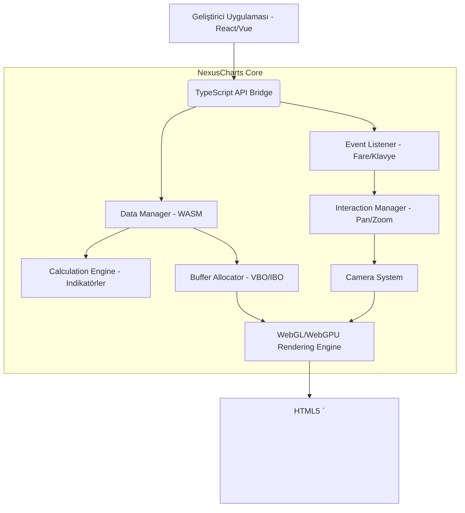

# NexusCharts - Sistem Mantığı (Logic Tree)

## Modül Ayrıştırma (Mermaid Graph)

## Node -> Rol Eşleştirmesi

| Node | İlgili Rol | Ana Görev |
|---|---|---|
| C, D, H | **WASM Engineer** | Milyonlarca veriyi kasmadan C++ üzerinde barındırmak ve GPU için Buffer hazırlamak. |
| I | **Graphics Programmer** | Shader kodları ve Instanced Rendering (Binlerce mum çizimi). |
| B, E | **API Architect** | Kullanıcı dostu, TradingView benzeri ama çok daha genişletilebilir NPM API'sini kurmak. |
